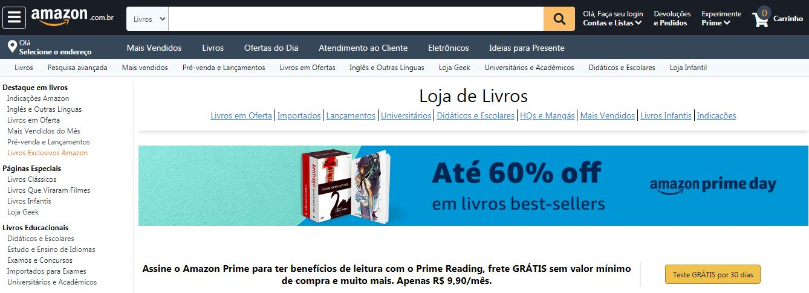

<h1 align="center">
 
  
 
 

</h1>

Clone da página da Amazon, utilizando tailwind

  

  
 

## Features

-  **Tailwind** — A utility-first CSS framework .

## License

This project is licensed under the MIT License - see the [LICENSE](https://opensource.org/licenses/MIT) page for details.